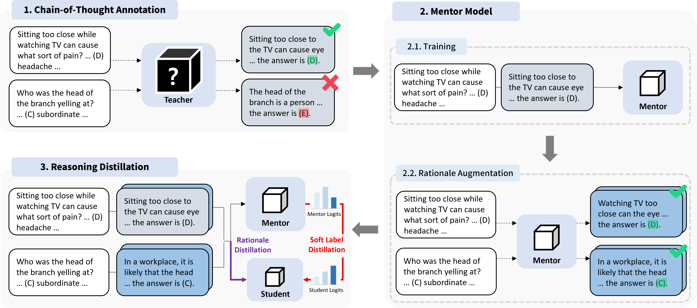

# Mentor-KD

### Mentor-KD: Making Smalll Language Models Better Multi-step Reasoners
Hojae Lee*, Junho Kim*, SangKeun Lee (*: equal contributon)

This repository contains the code and datasets used for our study ["Mentor-KD: Making Small Language Models Better Multi-step Reasoners"](https://arxiv.org/abs/2410.09037) which is to appear in EMNLP 2024. In this paper, we improve reasoning distillation by leveraging task-specific intermediate-sized mentor models which complements insufficient distillation signals from the teacher model.

👷‍♂️ **Some code files will be refactored for better readability in the near future!**

## Overview



## Requirements
### Required Tools
- Python >= 3.10
- torch >= 2.0.0
- transformers >= 4.41.2
- peft >= 0.4.0 


### Data
All data used in our study can be found in the `data/` directory. As mentioned in Appendix A, we use CoT annotations as well as train-test dataset splits previously collected by MCC-KD[^mcckd], specifically for CommonsenseQA, GSM8K, ASDiv, SVAMP. For other datasets, we newly prompt `gpt-3.5-turbo-instruct` and collect CoT annotations, while following the train-test dataset splits from Fine-tune-CoT[^ftcot].

Please refer to each studies' GitHub repository for the original data: [[MCC-KD]](https://github.com/homzer/MCC-KD) [[Fine-tune-CoT]](https://github.com/itsnamgyu/reasoning-teacher)


## Reproduction
We provide shell scripts to reproduce the results reported in our paper as below.

A task-specific intermediate-sized mentor model must be trained before conducting reasoning distillation to the student. We provide shell scripts for training the mentor model, using it for means of rationale augmentation, and finally for training the student models via our Mentor-KD framework.

### Training the Mentor Model
```
bash shells/fine_tune_cot/run_fine_tune_cot.sh
```

### Rationale Augmentation via the Mentor Model
```
bash shells/data/augment_train_data.sh
```

### Reasoning Distillation (Training the Student Model)
```
bash shells/kd/run_mentor_kd.sh
```

## Citation
The official BibTeX formatted citation will be available upon publication.


## Point of Contact
For personal communication related to Mentor-KD, please contact Hojae Lee via <22leehojae@korea.ac.kr>.


[^mcckd]: Chen et al., "MCC-KD: Multi-CoT Consistent Knowledge Distillation", Findings of EMNLP 2023.
[^ftcot]: Ho et al., "Large Language Models are Reasoning Teachers", ACL 2023.
